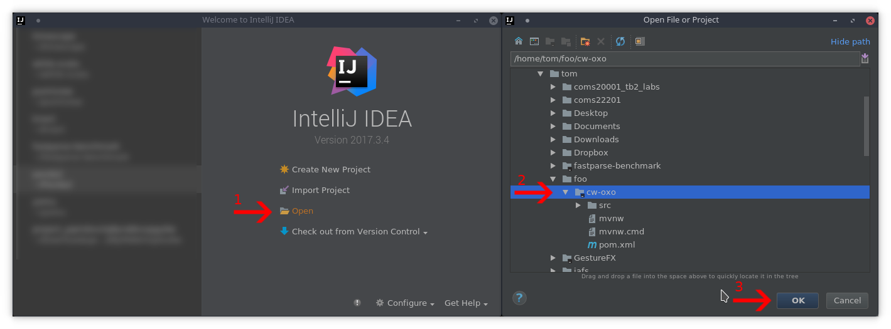
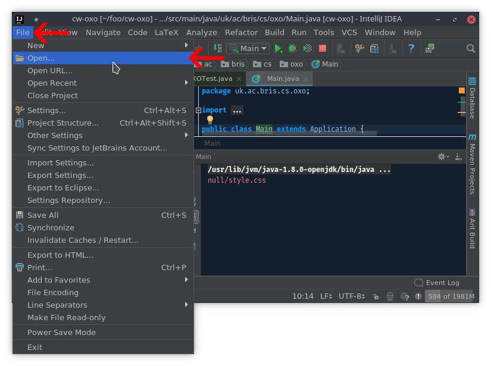
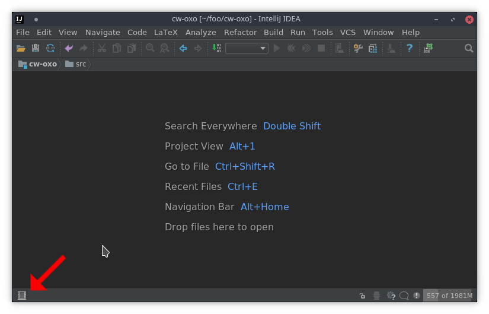
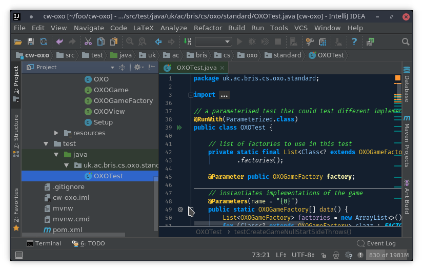
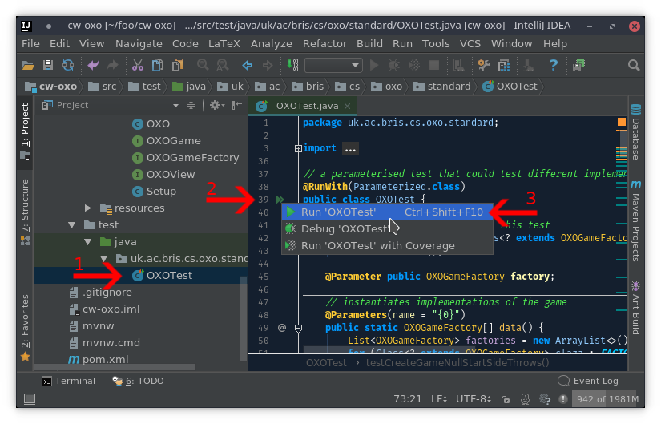
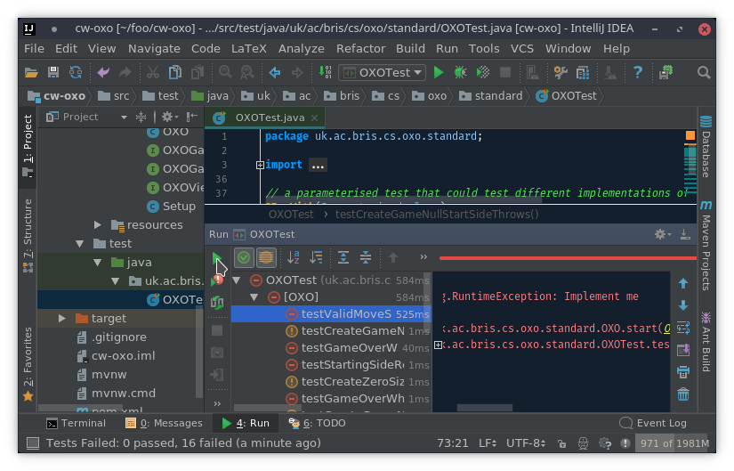
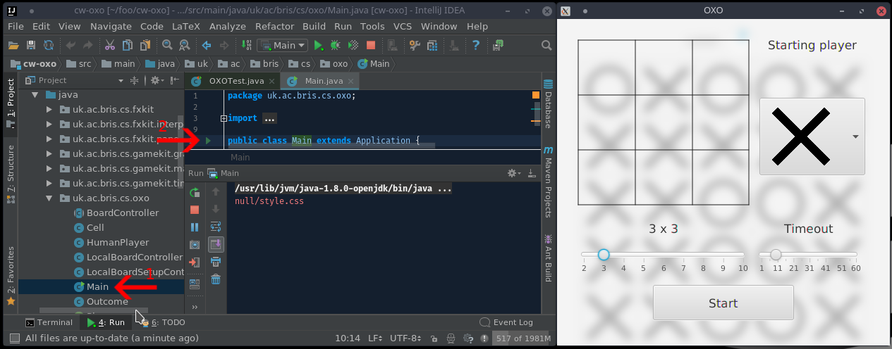

IntelliJ project import setup guide
====================================

**Important**: If you are using IntelliJ, please read the [IntelliJ](guides/INTELLIJ.md)
instructions **carefully**. If you imported the project and some of code is highlighted red or
simply not working then it may be easier to download a fresh copy the skeleton project and follow
the instructions.

First, download the project and extract in a suitable location, select the **project directory**
like the following

If you see the welcome screen, select `Open` (**Do not choose `Import Project`**):

If you do not see the welcome screen, go to `File` -> `Open` in the menu:

You may need to click the little button on the bottom left as marked with the red arrow:

## Running unit tests

This is analogous to `mvn clean test`

Locate the tests in the left hand side project view:

Select the test to run and click on the green button next to the line number, then select first
option(i.e `Run ...`)

IntelliJ will take a few seconds to compile files and run the test specified, the output will look
like the following:

You can right click on individual tests to run them again.

## Running `main`

This is analogous to `mvn clean compile exec:java`

Select the main class, and click the green button next to the line number like shown:

The application will start, in this case it opened the window on the right.
