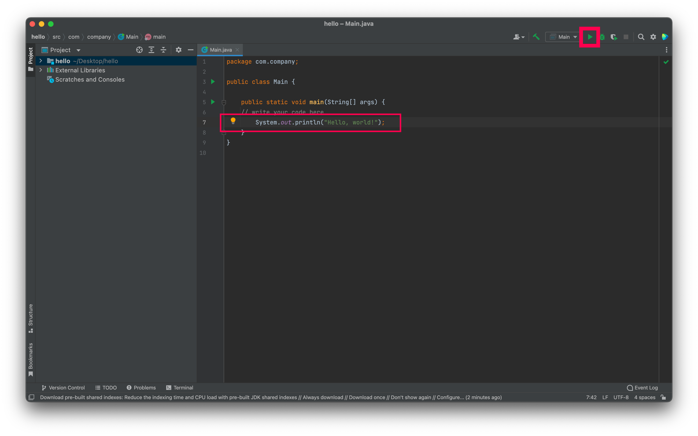

# IntelliJ JDK setup


We will be installing Java (JDK) through IntelliJ directly.
You may already have Java installed through your platform's package manager, we won't be using that for portability reasons.


## Installing JDK via IntellJ

First, launch IntelliJ, you should see the following window:


Select `New project` on the top right.

In the `New project` dialog, click the `Project SDK` dropdown and select `Download JDK`.


Make sure you configure the `Download JDK` dialog as follows:

 * Version: 17
 * Vendor: Oracle OpenJDK
 * Location: (leave default, don't modify)


Click download and wait for installation to complete.
Once installed, the `Project SDK` dropdown should now show the JDK you have just installed.

Click `Next` in the `New project` dialog, make sure *not* to check anything in the `Additional Libraries and Frameworks` section, leave everything default here.


Check `Create project from template` and click `Next`.


Set the `Project name` to `hello` and make note of the project location.
Keep everything else default and click `Finish`.
IntelliJ will setup a new project, this may take a few minutes.


Once completed, type the line `System.out.println("Hello, world!")` after  `// write your code here`.
Click the green play button on the top right and observe program output.




## Adding JDK to PATH

Now that we have our JDK installed through IntelliJ, we need to add it to PATH for `java`, `javac` and all other Java related commands to work.

First, to find out where the JDK you've installed through IntelliJ is located, navigate to the menu and select `Project Structure`.
On macOS, it's part of the application menu:


On Linux and Windows, it's part of the application window:


In the `Project Structure` window, click the `Edit` button next to the SDK dropdown (alternatively, select `SDKs` on the left hand side):


Make note of the `JDK home path` by copying that path to a text editor:


The path will be different depending on your platform (it's usually `~/.jdks/<JDK_VERSION>` on Linux and Windows and `~/Library/Java/...` on macOS).

Now, prepend that path to your PATH variable, this is different for each platform.
Run the following in a Terminal, replace `<JAVA_HOME>` with the `JDK home path` you've noted above :

**macOS**
```shell
echo "export PATH=<JAVA_HOME>/bin:$PATH" >> ~/.zshrc
source ~/.zshrc
java -version
```
**Linux (incl. Lab Machines)**
```shell
# if you know your what shell you're using, prepend <JAVA_HOME>/bin to PATH 
echo "export PATH=<JAVA_HOME>/bin:$PATH" >> ~/.bashrc
source ~/.bashrc
java -version
```
**Windows**
 1. Hit the `Start` key and search for `Edit environment variables for your current account`, select the result, you should see the following dialog:
   
 2. Check to see whether `Path` exists on the top (`User variables`) list, if it does, select it and click `Edit`, add `<JAVA_HOME>/bin` in the `Edit environment variable` dialog:
   
 3. Alternatively, if `Path` does not exist, create a new one  by clicking `New` and fill out the dialog:
   
 4. Restart all open Terminals  


Verify that you've completed the setup by starting a new terminal window and run `java -version`.
It should report the version you've selected in IntelliJ.