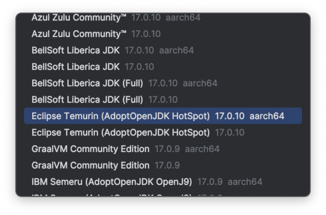

## Ubuntu Virtual Machine on Apple Silicon (credit to current 1st year student) - WARNING, YOU INSTALL THIRD PARTY SOFTWARE ONTO YOU OWN MACHINE AT YOUR OWN RISK

[UTM](https://docs.getutm.app/guides/ubuntu/) running [Ubuntu Server for Arm](https://ubuntu.com/download/server/arm) with the Desktop Environment has been tested with the Scotland Yard Coursework and runs reliably on the two machines we have tested it on. It also is useful throughout your studies to have a true Linux environment to supplement your Mac

### Installing UTM running Ubuntu Server + Desktop Environment

1. Follow the [UTM](https://docs.getutm.app/guides/ubuntu/) tutotial.
2. If you have trouble sharing folders try the following in a terminal (credit to current 1st year student):
```
    $ sudo mkdir [mount point]
    $ sudo mount -t 9p -o trans=virtio share [mount point] -oversion=9p2000.L
    $ sudo chown -R $USER [mount point]
```
3. Install the Arm version of Intellij onto you Ubuntu VM. [ideaIC-2023.3.5-aarch64.tar.gz](https://download.jetbrains.com/idea/ideaIC-2023.3.5-aarch64.tar.gz?_gl=1*16wkqnv*_ga*ODY5OTEwMDM2LjE3MDE2OTExNTg.*_ga_9J976DJZ68*MTcxMDg1Nzg3Mi41LjEuMTcxMDg1Nzg5NS4wLjAuMA..&_ga=2.16582838.1020350076.1710857872-869910036.1701691158)
4. Make sure install the Arm version of Java too (on your Ubuntu VM via Intellij):
   
   
5. Follow the [Linux instructions](https://github.com/UoB-OOP/COMS10017-2024/blob/main/guides/SETUP.md#linux) to complete your new VM setup.
