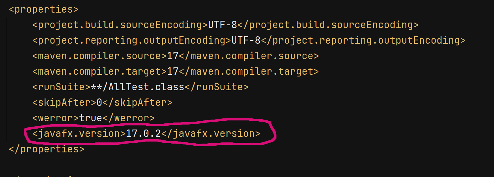
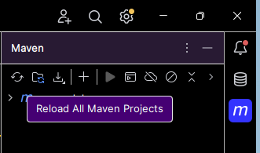
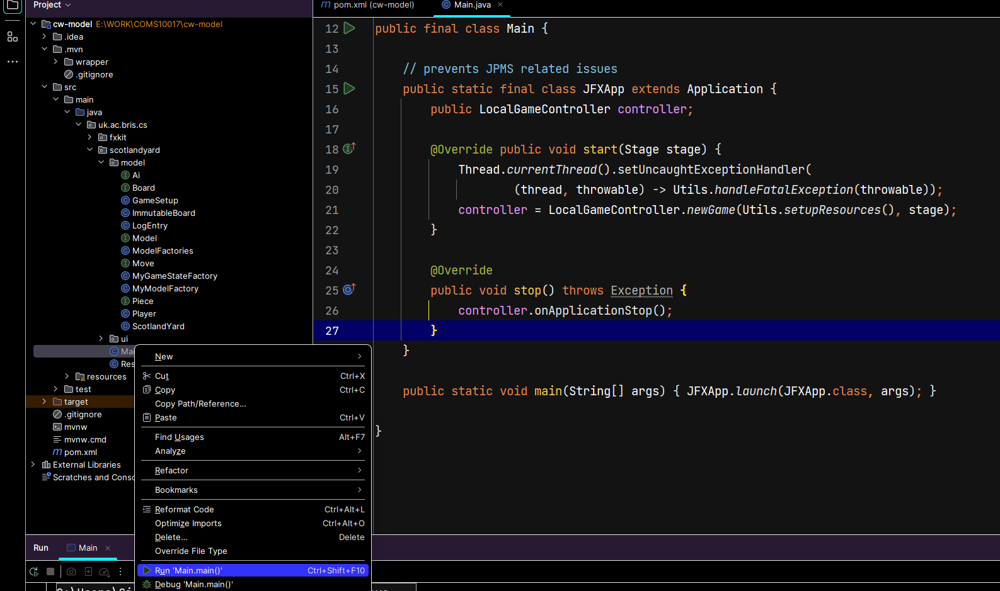

Java FX fix for Apple Silicon
=========================

1. In the pom.xml file (for both the model and the AI), modify the javafx.version field from ```17.02``` to ```23-ea+3```:


2. Delete you local Maven repo. In the terminal type: ```rm ~/.m2```

3. Reaload Maven in Intellij:
  
   

4. Try running the GUI again:
   
