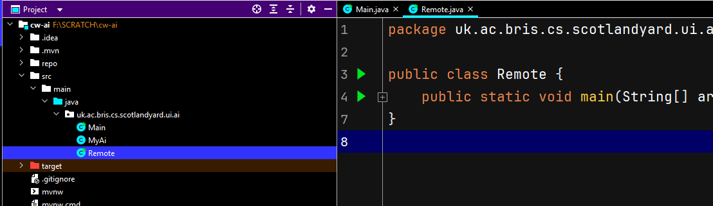

CW-AI
-----

This second coursework part completes the Scotland Yard project, it is open-ended. Before embarking
on it make sure you have produced a bug-free, stable, well coded and well documented model for
the `CW-MODEL` part. Make sure you take some time again to review the object-orientation concepts
covered in the course and used in your implementation so far that you are ready for your
presentation and VIVA.

In this coursework, your programming team of two will create a simple Artificial Intelligence (AI)
component to automate the playing of the game Scotland Yard for MrX, and optionally the detectives.
You will receive the same user interface (UI) from `cw-model` that allows you to test and play
against your AI. This coursework part also prepares you for taking part in the purely formative
COMS10017 competition with your own AI component, although you can also take part by playing
manually.

## Getting started

**TODO:** As in previous courseworks, create a private repository shared within your team with the
code from this zip file in it:

* [cw-ai](https://www.ole.bris.ac.uk/bbcswebdav/courses/COMS10017_2023_TB-2/content/oo/code/cw-ai.zip)

If you use Git, a `.gitignore` file is already present with all the correct files to ignore.

***

As in the previous exercise, this project uses *Maven* as a build system. Please refer to previous
coursework descriptions for setup, use and background details if needed.

* IntelliJ - follow the import
  guide [here](https://web.microsoftstream.com/video/6bab3abf-41f3-4a30-8643-4b07ce35301c). The main
  class to start the UI is `uk.ac.bris.cs.scotlandyard.ui.ai.Main`.
* CLI - type the following command at project root (use PowerShell on Windows):

      # for compilation: 
      ./mvnw clean compile 
      # for starting the UI: 
      ./mvnw clean compile exec:java 

The game UI should start. In the game configuration dialog, find the `Name me!` AI; selecting this
AI relates to the skeleton AI implementation located in `uk.ac.bris.cs.scotlandyard.ui.ai.MyAI`.
Open that file and look around.

Pick a name for your AI implementation. It is recommended that you also rename the class to match
your AI name.

When starting the GUI anew you should then find your AI listed in the game configuration dialog. You
may have multiple AIs (one for MrX, one for the detectives) implemented later in development. The
game model should then scan the classpath, find your AI automatically, and add it to the GUI as an
option.
***

**TODO:** Name your AI
***

## AI Development

After naming your AI, you are now ready to start implementing actual AI logic. As you can see in the
skeleton code, your AI class implements `uk.ac.bris.cs.scotlandyard.model.Ai`. The game model will
call your Ai's `pickMove` method when a move needs to be chosen from the the available moves.

Currently, the skeleton code simply returns a random available move back to the game. Your task is
to extend the method so that the returned move is well chosen in order to get MrX closer to winning
the game.

The `Ai` interface also comes with two further (empty) default methods, which you can implement with
your own custom behaviour.  
For example, you may wish to perform setup and clean up tasks in the `onStart()` and `onTerminate()`
methods, respectively.

For help and guidance with your development for a scoring function, a game tree, a Mini-Max based AI
for MrX and how to get started, take a look at the [guide](#guide) now.

**TODO:** Implement a scoring function, a game tree, and a Mini-Max based AI for MrX and enhance it
with Alpha-beta Pruning and other features

At this point you should have a well working AI that can look a few rounds ahead. Start up the GUI
and test it out!

## Have your AI interact on remote server with other players

## Extensions

Before embarking on extensions make sure you have fully finished the `cw-model` coursework, all
tests pass and you have produced a bug-free, stable, well coded and well documented model, which you
understand well for both `cw-model` and `cw-ai`. You should consider the time budget you have left
before working on extensions since there are diminishing returns.

Now, that you have a working Scotland Yard AI for MrX, extend your AI so that there is a fully or
partly automated play option for detectives and/or improve your AI further - make it better in terms
of game-play or faster. We're going to leave these improvements up to you, so be as creative as
possible. Possible extensions could include clever pruning of your game tree, dynamic tree depth
management, parallelising your AI, refactoring parts of the project to improve OO properties further
etc. Let your imagination run wild!

**TODO:** Implement extensions, do something impressive.

<!--

## Competition

There will be a Human-vs-Machine competition advertised on the unit website, where you and your AIs
will play against manual, part-manual or automatic team entries. (Each player (human or machine!)
will have 15s only to provide a move or loose the game.)
A week before competition day you will be supplied a with a client that can use your AI player code
and connect to a competition server. You will have to manually migrate your AI to the client
project. In most cases, simply copying your AI class to the correct package will work. More details
will be posted on the unit website before the competition.
-->

## Implementation Guide

Recommended reading:

* Scotland Yard game rulebook
* Guava's [ValueGraph](https://github.com/google/guava/wiki/GraphsExplained#valuegraph) section
<!--- * Live Programming Lecture on Graph Algorithms)-->

For the game of Scotland Yard, the AI's objective is to make the best possible move towards winning
the game. In general, for detectives, a good move is one that will either capture or get close to
MrX. For MrX, a good move is usually one that will get away from detectives and open up a wide
variety of moves. The focus of the task is on writing an AI for MrX.

A reasonable first step for a MrX AI is the implementation of a scoring method `score` for a
given `Board` that takes into account attributes such as distance to detectives, freedom of movement
based on available target locations, etc. You should then utilise this method to select an available
MrX move by picking the one that leads to a board with the best possible score for MrX. A most
simple scoring method would consider the neighbouring nodes to MrX's position and check if
detectives are present there. For a more sophisticated scoring method, you should try to incorporate
algorithms such as [Dijkstra](https://en.wikipedia.org/wiki/Dijkstra's_algorithm) as discussed in
the lecture to calculate distances from MrX to the detectives amongst other features.

Incorporating your scoring method into the `pickMove` method by picking the move that will lead to
the highest scoring board will lead to a look-ahead-one AI, where you compare the fitness of
possible game configurations after your next move. This is a first step towards constructing a game
tree and using the MiniMax algorithm to find a good move for MrX when considering looking into the
future of the game further. Once a Mini-Max implementation is in place, try pruning the tree using
Alpha-Beta-pruning.

Implementing the AI is an incremental process, you are encouraged to launch the UI, select your AI
and then observe the behavior of your AI whenever you make major changes. When you run the game with
an AI selected, the game map should show move traces of each player which may be useful.

**Note on external libraries**: you may use libraries that would help you develop a better AI as
long as you both clearly cite this in your report and mention it at the beginning of your
presentation. In any case, we will assess your work and your understanding of it, not the work
others have put in to create libraries.

**Note on threading**:
The `uk.ac.bris.cs.scotlandyard.model.Ai#pickMove` method will be executed on a thread of its own
managed by the runtime. Please explicitly synchronise access to non-thread safe objects yourself. If
you are not sure what threading means, and you are not parallelising your solution, you can
disregard this note.
