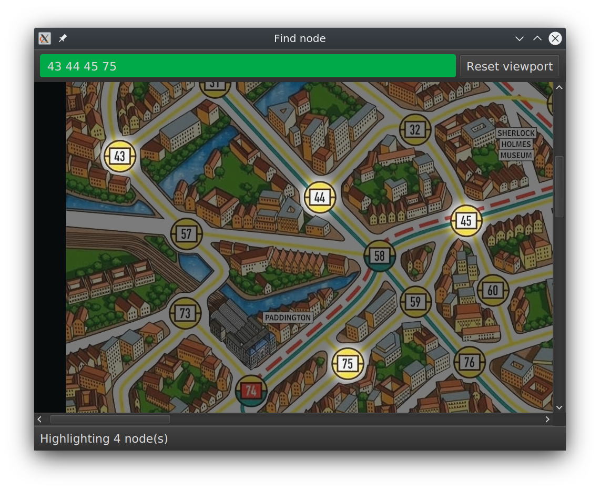

CW-MODEL
========

In this first task we will ask you to implement Java classes, which model the game mechanics of
"Scotland Yard" within a given software framework.

Note that you will implement the full version of the game (not the beginners version), but with the
following alterations/clarifications:

* Police or Bobbies will not be modelled.
* The Ferry will be modelled.
* Mr X and the detectives will be given variable (user-specified) amounts of tickets at the start, the normal rules for tickets follow:
  - When a detective moves, the ticket used will be given to Mr X.
  - Used Mr X tickets are discarded.
* The number of rounds in a game is variable (>0) specified by an initial setup rather than fixed to 22 rounds as in the board game. 
  - In the manual, the round count is defined as the number of transitions between Mr X and the detectives as a whole, this number is different from the number of slots on Mr X's Travel Log because Mr X can use double moves which occupies two slots (e.g. a 22 round game with two double move tickets means Mr X can have up to 24 moves). 
  - For practical reasons, we've simplified this rule so the game can be set up with a variable max number of moves for Mr X (i.e. the slot count in Mr X's travel log), such that the game is over when Mr X's travel log is completely full, instead of some arbitrary number of rounds.
* Mr X cannot move into a detective location.
* Mr X loses if it is his turn and he cannot make any move himself anymore.
* Detectives lose if it is their turn and none of them can move, if some can move the others are just skipped.
* `Ticket.SECRET` represents a black ticket, this is used for Mr X's secret moves

Pay special attention to rules for double moves and secret moves, since these are particularly
complex.

***

* Download a copy of the full rulebook
  from [Ravenburger's website](https://www.ravensburger.org/spielanleitungen/ecm/Spielanleitungen/26646%20anl%202050897_2.pdf)
* ### Download the Java version of the game
  * #### Linux   
    - [Remote, Linux and x86_64](https://www.ole.bris.ac.uk/bbcswebdav/courses/COMS10017_2023_TB-2/content/oo/code/scotlandyard-remote-2024-linux-x86_64.jar)
    - [Local, Linux and x86_64](https://www.ole.bris.ac.uk/bbcswebdav/courses/COMS10017_2023_TB-2/content/oo/code/scotlandyard-local-2024-linux-x86_64.jar)
    - [Remote, Linux and arm64](https://www.ole.bris.ac.uk/bbcswebdav/courses/COMS10017_2023_TB-2/content/oo/code/scotlandyard-remote-2024-linux-arm64.jar)
    - [Local, Linux and arm64](https://www.ole.bris.ac.uk/bbcswebdav/courses/COMS10017_2023_TB-2/content/oo/code/scotlandyard-local-2024-linux-arm64.jar)
  * #### Apple 
    - [Remote, Mac (M1,M2,M3) and arm64](https://www.ole.bris.ac.uk/bbcswebdav/courses/COMS10017_2023_TB-2/content/oo/code/scotlandyard-remote-2024-mac-arm64.jar)
    - [Local, Mac (M1,M2,M3) and arm64](https://www.ole.bris.ac.uk/bbcswebdav/courses/COMS10017_2023_TB-2/content/oo/code/scotlandyard-local-2024-mac-arm64.jar)
    - [Remote, Mac (Intel) and x86_64](https://www.ole.bris.ac.uk/bbcswebdav/courses/COMS10017_2023_TB-2/content/oo/code/scotlandyard-remote-2024-mac-x86_64.jar)
    - [Local, Mac (Intel) and x86_64](https://www.ole.bris.ac.uk/bbcswebdav/courses/COMS10017_2023_TB-2/content/oo/code/scotlandyard-local-2024-mac-x86_64.jar)
  * #### Windows
    - [Remote, Windows) and x86_64](https://www.ole.bris.ac.uk/bbcswebdav/courses/COMS10017_2023_TB-2/content/oo/code/scotlandyard-remote-2024-win-x86_64.jar)
    - [Local, Windows) and x86_64](https://www.ole.bris.ac.uk/bbcswebdav/courses/COMS10017_2023_TB-2/content/oo/code/scotlandyard-local-2024-win-x86_64.jar)


The executable is a JAR file, run it on your machine like so:
  ```shell
   java -jar <path_to_the_game_jar_file_you_have_just_downloaded_from_above>
  ```
This game is the online version with an offline mode in the menu (accessible via `Game | Local game`).

For the offline mode, follow the instructions in [this video](https://web.microsoftstream.com/video/12e040aa-10d3-447b-a27f-0d2d4f9a911a) where Sion plays against himself.
For the online mode, use the credentials which are available [here](https://www.ole.bris.ac.uk/bbcswebdav/courses/COMS10017_2023_TB-2/content/oo/pdfs/2023_SY_credentials.pdf). Search for your UoB username in the 3rd column and then note down your personal username (integer on in 1st column) and password (alphanumeric string in 2nd column). Do **not** use personal data for your team's name when connecting to the game server: make up something fun!

* How do I know I am using an M1. M2 or M3 (Apple Silicon) Mac?
  * Click on the `Apple logo` on the menu bar and click on `About This Mac`. in the `Chip` section, if you see something that starts with `Apple`, you are using an Apple Silicon Mac; if it starts with `Intel`, you are using an Intel Mac.
  * For Apple Silicon Mac users, you should look for the following fields when downloading softwares: `Apple Silicon`, `arm64`, `aarch64`, `Arm Mac`, `M1 Mac`, `M2 Mac`
  * For Intel Mac users, you should look for the following fields when downloading softwares: `x86_64`, `x64`, `AMD64`, `Intel Mac`

* Connecting to the online game server via SOCKS5 proxy. (OPTIONAL) [here](proxy.md)

**TODO:** Familiarise yourself with the rules of the Scotland Yard board game and organise some
sessions to play the game!


***

## Getting Started

This is a pair programming exercise, so you are strongly recommended to use version control software
such as Git and work in your team using a **private** online repository. Try to do as much pair
programming (one screen, two minds) as possible.

This project uses Maven as a build system. You do not need to understand the inner workings of
Maven, but feel free to read up about it [here](maven.md).

***

**TODO:** Start by creating a repository with the skeleton code from this zip file in it:

* [cw-model](https://www.ole.bris.ac.uk/bbcswebdav/courses/COMS10017_2023_TB-2/content/oo/code/cw-model.zip)

If you use Git, a `.gitignore` file is already present with all the correct files to ignore.

***

**TODO:** Setup the Project

* IntelliJ - follow the import
  guide [here](https://web.microsoftstream.com/video/6bab3abf-41f3-4a30-8643-4b07ce35301c)
  . The main test class is `uk.ac.bris.cs.scotlandyard.model.AllTest`, the main class to start the
  UI is `uk.ac.bris.cs.scotlandyard.Main`.
* CLI - type the following command at project root (use PowerShell on Windows):

      ./mvnw clean compile 

### Project Structure

The project's main source files are all located in `src/main/java` and organised in directories
according to the package name, for example `uk.ac.bris.cs.scotlandyard.model.ScotlandYard` is a file
located at `src/main/java/uk/ac/bris/cs/scotlandyard/model/ScotlandYard.java`.

The main focus of this project is to write a working Scotland Yard game model, thus your work will
focus around the `uk.ac.bris.cs.scotlandyard.model` package. You will only need to edit two
classes: `MyGameStateFactory.java` and `MyModelFactory`. You are allowed to add new classes to the
package. You are not allowed to modify any of the interfaces or tests.

### Testing

There are 82+ tests provided for your development. They are located in `src/test/java` and organised
in the same directory pattern. You should try to run the tests on the provided skeleton project.

**TODO:** Test the empty model and observe test failures:

* IntelliJ (**Recommended**) - Locate the class `uk.ac.bris.cs.scotlandyard.model.AllTest` in IntelliJ and right click
  the green play button in the left-hand side gutter (i.e. where the line number is). IntelliJ
  should run all the tests and present you with a test report.

* CLI - type the following command at project root:

      ./mvnw clean test

  The result will look something like this:

      Results :
      
      Failed tests: ...
      Tests in error: ....
      Tests run: 81, Failures: .., Errors: .., Skipped: 0
      ...

Some of the tests are written using [AssertJ](http://joel-costigliola.github.io/assertj/) to
simplify the statement of assertions. It will be sufficient for completing this exercise to just
read the test names and assertion statements to understand what the tests are testing.

While implementing the model, you may only want to focus on one particular test subset.

* IntelliJ (**Recommended**) - each test should have a green play button on the left; clicking on it should run that
  specific test.
* CLI - run a single test class by specifying the `test` argument when calling Maven, for example:

      ./mvnw -Dtest=GameStateCreationTest test

  You can also run a specific test case in a test class, for example:

      ./mvnw -Dtest=GameStateCreationTest#testNullMrXShouldThrow* test

## Development

For help and guidance with your development and how to get started, take a look at
the [guide](#guide) now.

**TODO:** Pass all tests.

When you're done with the model implementation, you can start the GUI and play your very own Java
version of Scotland Yard.

**TODO:** Start up the GUI and enjoy!

* Intellij - locate the class `uk.ac.bris.cs.scotlandyard.Main`, press the play button **next to the
  class declaration**.
* CLI - type the following command at project root:

      ./mvnw clean compile exec:java

If everything works and you can complete games then you have a working Scotland Yard model and have
completed the CW-MODEL coursework! Before embarking on the next step make sure you have produced a
bug-free, stable, well coded and well documented model, which you understand well. Make sure you
take some time again to review the object-orientation concepts covered in the course and used in
your implementation so you are ready for your presentation and VIVA. 

Stage 2 of the coursework (cw-wi) will be released at a later date.
<!-- Once you are confident, you can take a look at the final open-ended task [cw-ai](cw-ai.md). -->

### *Find node* tool

To make the development process smoother, a simple *Find node* tool is included in the GUI. The tool
does not require a working model, however, you need to make sure the project still compiles
otherwise the GUI won't start of course.

The *Find node* tool is located in the menu: `Help | Find node`, you should see a window that looks
like this:



Type in the node you want to find in the search bar, you may enter multiple nodes separated by
spaces, e.g `42 42 44 45`. The map supports panning and zooming just like the main game.

## <a name="guide"></a>Implementation Guide

Recommended reading:

<!-- @formatter:off -->
* [Scotland Yard game rulebook](https://www.ravensburger.org/spielanleitungen/ecm/Spielanleitungen/26646%20anl%202050897_2.pdf)
* Guava's [Immutable collections](https://github.com/google/guava/wiki/ImmutableCollectionsExplained) page
* Guava's [ValueGraph](https://github.com/google/guava/wiki/GraphsExplained#valuegraph) section
* [JavaDocs](https://seis.bristol.ac.uk/~sh1670/SY/apidocs2022/index.html) for cw-model, also available as comments in the skeleton <!-- TODO: dead link -->
<!-- @formatter:on -->

Look around in the `uk.ac.bris.cs.scotlandyard.model` package, you can complete this project part by
only using classes from this package and [Guava](https://github.com/google/guava/wiki) + JDK
standard class library.

#### FACTORY

To begin, locate the skeleton class `uk.ac.bris.cs.scotlandyard.model.MyGameStateFactory`. This is
the main class you need to implement to model the behaviour of our Scotland Yard game. As the name
tells us, this class is a factory that implements the `Factory<GameState>` interface. This means
that it has a factory method of some sort (`build` in this case) which returns a new instance of `GameState`. 
As we cae see, this method does indeed exist. 
However, we find a placeholder in the position where an implementation needs to be placed:

<!-- @formatter:off -->
```java
// TODO
throw new RuntimeException("Implement me");
```
<!-- @formatter:on -->

#### GAME STATE

When you implement a method, you should remove the placeholders as those are only present to
facilitate compilation. Next have a look at the Java documentation for
the `uk.ac.bris.cs.scotlandyard.model.Board.GameState` interface. We see that `GameState`
extends `Board` and thus will have to implement 8 methods; 7 inherited from `Board` plus
the `advance` method it requires. Your factory will need to return an *implementation* of this
interface. Let this implementation class, which implements `GameState`, be called `MyGameState`. Since
we only ever need the `MyGameState` class to be accessible from the factory, we can implement it as
an inner class of `MyGameStateFactory`. In addition, consider that the class can be `private`
and `final`. Adding our 8 methods with placeholder returns of `null` and defining required imports
leads to compiling code again:

<!-- @formatter:off -->
```java
package uk.ac.bris.cs.scotlandyard.model;

import com.google.common.collect.ImmutableList;
import com.google.common.collect.ImmutableSet;
import java.util.*;
import javax.annotation.Nonnull;
import uk.ac.bris.cs.scotlandyard.model.Board.GameState;
import uk.ac.bris.cs.scotlandyard.model.Move.*;
import uk.ac.bris.cs.scotlandyard.model.Piece.*;
import uk.ac.bris.cs.scotlandyard.model.ScotlandYard.*;

public final class MyGameStateFactory implements Factory<GameState> {
  private final class MyGameState implements GameState {
    @Override public GameSetup getSetup() {  return null; }
    @Override  public ImmutableSet<Piece> getPlayers() { return null; }
    @Override public GameState advance(Move move) {  return null;  }
  }
}
```
<!-- @formatter:on -->

#### ATTRIBUTES

Next lets start thinking about what state data `MyGameState` needs to hold and define some first
attributes. Exploring the getter methods, which we just defined, tells us that we at least need to
hold:

1) The `GameSetup` to return it, as well as have access to the game graph and Mr X reveal moves
2) A `Player` to hold the MrX player and a `List<Player>` to hold the detectives
3) A `List<LogEntry>` to hold the travel log and count the moves Mr has taken
4) A `Set<Move>` to hold the currently possible/available moves
5) A `Set<Piece>` to hold the current winner(s)

We also may want to keep track of which `Piece`
can still move in the current round, and which `Piece`s and `Player`s are in the game. Note that
many of the collections to be used should be immutable and private as good defensive programming
would prescribe, leading to a number of attributes such as:

<!-- @formatter:off -->
```java
...

private final class MyGameState implements GameState {
  private GameSetup setup;
  private ImmutableSet<Piece> remaining;
  private ImmutableList<LogEntry> log;
  private Player mrX;
  private List<Player> detectives;
  private ImmutableSet<Move> moves;
  private ImmutableSet<Piece> winner;
  ...
}
```
<!-- @formatter:on -->

#### CONSTRUCTOR

Let us now move on and write a constructor for `MyGameState` (consider, once done, which of our
attributes can be be made `final`). Our constructor will be called by the `build` method of the
outer class `MyGameStateFactory`, thus it should make use of at least the information available
there:

1) The game setup
2) The `Player` mrX
3) The `ImmutableList<Player>` detectives

In addition, we should provide the remaining players (just MrX at the starting round) and the
current log (empty at the starting round) so that the constructor can complete a full initialisation
of the game state. Our constructor could, considering the incoming parameters as immutable, start
off like this:

<!-- @formatter:off -->
```java
...
private MyGameState(
      final GameSetup setup, 
      final ImmutableSet<Piece> remaining, 
      final ImmutableList<LogEntry> log,
      final Player mrX,
      final List<Player> detectives){ ... }
...
```
<!-- @formatter:on -->

Note that the constructor is private since only the builder in the enclosing class (and later the
advance method) will be calling it. Now that we have at least the declaration of a `MyGameState`
constructor available, we should return a new instance of `MyGameState` in the `build` method
of `MyGameStateFactory`:

<!-- @formatter:off -->
```java
...
@Nonnull @Override public GameState build(...){
  return new MyGameState(setup, ImmutableSet.of(MrX.MRX), ImmutableList.of(), mrX, detectives);
}
...
```
<!-- @formatter:on -->

#### INITIALISATION

So far, we took care of an appropriate structure for our implementation, but did not aim at passing
any tests yet. We now move on to implementing the constructor in order to check and initialise
fields using the parameters passed into the constructor. First, we could initialise the local
attributes that are directly supplied by the parameters:

<!-- @formatter:off -->
```java
private MyGameState(...){
  ...
  this.setup = setup;
  this.remaining = remaining;
  this.log = log;
  this.mrX = mrX;
  this.detectives = detectives;
  ...
}
```
<!-- @formatter:on -->

Add appropriate checks that these parameters handed over are not `null` and you will pass your first
tests in `GameStateCreationTest`. Start working your way through the tests guiding your
implementation. You may add checks, entire methods, fields, or even classes as you see fit. For
instance, the test `#testEmptyMovesShouldThrow` demands that there is at least one move to play,
otherwise an `IllegalArgumentException` should be thrown. Thus, you should add a check in the
constructor like this:

<!-- @formatter:off -->
```java
...
if(setup.moves.isEmpty()) throw new IllegalArgumentException("Moves is empty!");
...
```
<!-- @formatter:on -->

#### GETTERS

Some further checks and tests will be required in the constructor, including checks that all
detectives have different locations, that detectives in the list are indeed detective pieces, MrX is
indeed the black piece, and that there are no duplicate game pieces. Let the tests guide you in this
regard. Having defined our attributes, we can also start returning values in our getter methods (
leave the `getWinner` method until later). Note that some getter methods need to return `Optional`
values:

<!-- @formatter:off -->
```java
...
@Override public GameSetup getSetup(){ return setup; }
@Override public ImmutableList<LogEntry> getMrXTravelLog(){ return log; }
@Override public Optional<Integer> getDetectiveLocation(Detective detective){
  // For all detectives, if Detective#piece == detective, then return the location in an Optional.of();
  // otherwise, return Optional.empty();      
}
...
```
<!-- @formatter:on -->

#### AVAILABLE MOVES

Not all values can be easily assembled - `getAvailableMoves()` for instance requires us to find
**all** moves `Player`s can make for a given `GameState`. It will be easiest to calculate these
moves upfront in the constructor of a `GameState` and store them in `moves`, but for such a complex
task it is recommended to use some helper methods to avoid monolithic code and an overlong
constructor. One helper function could be the calculation of single moves, thus consider the below
snippet of code as a start and inspiration on how to implement valid move generation:

<!-- @formatter:off -->
```java
...
private static Set<SingleMove> makeSingleMoves(GameSetup setup, List<Player> detectives, Player player, int source){
 
  // TODO create an empty collection of some sort, say, HashSet, to store all the SingleMove we generate
  
  for(int destination : setup.graph.adjacentNodes(source)) {
    // TODO find out if destination is occupied by a detective
    //  if the location is occupied, don't add to the collection of moves to return      
    
    for(Transport t : setup.graph.edgeValueOrDefault(source, destination, ImmutableSet.of()) ) {
      // TODO find out if the player has the required tickets
      //  if it does, construct a SingleMove and add it the collection of moves to return  
    }
    
    // TODO consider the rules of secret moves here
    //  add moves to the destination via a secret ticket if there are any left with the player
  }
  
  // TODO return the collection of moves
}
    ...
```
<!-- @formatter:on -->

However, the above code is only a starting point for an implementation since `DoubleMove`s have to
be implemented too, and they are more tricky to handle. Once moves and all exposed state is computed
and returned by the `getter` methods you will pass more tests.
Implementing `GameStage#getAvailableMoves` correctly should help pass
through `GameStateMrXAvailableMovesTest` and `GameStateDetectivesAvailableMovesTest`.

#### ADVANCE

Our attention can now shift towards the `GameState#advance` method, whose task it is to return a new
state from the current `GameState` and a provided `Move`. The `GameState#advance`
method is central to the behaviour of a game, and most tests depend on this method to verify
behaviours of the players. This is the hardest part to implement, so you may want to break up some
of this logic into separate, smaller private methods. The first thing we must check is that the
provided `move` is indeed valid using code similar to:

<!-- @formatter:off -->
```java
...
public GameState advance(Move move){
  if(!moves.contains(move)) throw new IllegalArgumentException("Illegal move: "+move);
  ...
}
...
```
<!-- @formatter:on -->


##### VISITOR PATTERN

Next, we need to implement different behaviours for applying `SingleMove`s and `DoubleMove`s, e.g.
we may need `destination` or `destination2` for enacting moves. To route these different
implementations and find out about the `Move` type we can use the visitor pattern. Familiarise
yourself with the interface `Move`, which has a generic `accept` method to support the Visitor
design pattern:

<!-- @formatter:off -->
```java
public interface Move extends Serializable {
  ...

  <T> T accept(Visitor<T> visitor);
  ...
}
```
<!-- @formatter:on -->

Note that this is very similar to the house visitor we looked at in previous weeks ([tasks](https://github.com/UoB-OOP/COMS10017-2023/blob/main/week16.md), [solutions](https://www.ole.bris.ac.uk/bbcswebdav/courses/COMS10017_2023_TB-2/content/oo/pdfs/house-visitor-solutions.zip)). If you have not completed those exercises, it's highly recommended you do so (or at the very least look at the solutions) to understand how the visitor pattern works. If you understand the house visitor, you more or less already understand the move visitor. Just as we used the visitor pattern to distinguish StrawHouses, StickHouses, and BrickHouses, we can use it to distinguish SingleMoves and DoubleMoves.

The generic `House.Visitor<T>` interface is very similar to `Move.Visitor<T>`, and the
corresponding `accept()` methods are effectively identical, as we can see by comparing the implementations in `BrickHouse` and `SingleMove` (very slightly modified for clarity):

<!-- @formatter:off -->
```java
...

public class BrickHouse extends House {
  ...
  public <T> T accept(House.Visitor<T> visitor) { return visitor.visit(this); }
}

final class SingleMove implements Move {
  ...
  public <T> T accept(Move.Visitor<T> visitor) { return visitor.visit(this); }
}
```
<!-- @formatter:on -->

Consequently, we can get access to a particular `SingleMove` or `DoubleMove` by supplying
a `Visitor<...>` object as a parameter to the `move.accept(...)` method. This parameter could be an
anonymous inner class instantiation such as:

<!-- @formatter:off -->
```java
... = move.accept(new Visitor<...>(){
  @Override public visit(SingleMove singleMove){ ... }
  @Override public visit(DoubleMove doubleMove){... }
});
```
<!-- @formatter:on -->

Equally, it could be defined in the normal way using a separate file and creating a named class which implements the `Move.Visitor<T>` interface, or any of the other ways demonstrated in the house visitor task.

##### STATE UPDATE

With access to the particular `move` to enact we can now implement the update of the state, which
means returning a new `GameState` object (since the old one is widely immutable) at the end of
the `advance` method. This returned state should be updated with regard to: 1) player locations, 2)
tickets used and handed over to players, 3) travel log if `move.commencedBy` is MrX, and 4)
remaining pieces in play for the current round (and if none remain an initialisation of players for
the next round). 

This returned state should somehow be updated in the following way (not necessarily in order):
- If it's Mr X's turn (which can be checked using `move.commencedBy`):
  - Add their move(s) to the log
    - If a move should be revealed according to the `GameSetup`, reveal the destination in the log,
    otherwise keep the desination hidden
  - Take the used ticket(s) away from Mr X
  - Move Mr X's position to their new destination
  - Swap to the detectives turn
- If it's the detectives' turn:
  - Move the detective to their new destination
  - Take the used ticket from the detective and give it to Mr X
  - Ensure that particular detective won't move again this round (i.e. when `getAvailableMoves()` is called, it won't include any moves from that detective)
  - If there are no more possible detective moves, swap to Mr X's turn

Make sure to refer back to the [Scotland Yard game rulebook](https://www.ravensburger.org/spielanleitungen/ecm/Spielanleitungen/26646%20anl%202050897_2.pdf), as well as the alterations/clarifications at the top of the page, for more details on the game logic.

A correctly implemented `advance` method should pass most tests in `GameStatePlayerTest` and  `GameStateMoveTest`.

##### DETERMINE WINNER

Once the selection of moves and the advancement of the `GameState` are implemented, the game will
need to determine if someone has won or not. This can again be done in the constructor
of `GameState`; if no winner has been determined yet then `getWinner()` should return an empty set.
In any case, implement checks for end game conditions and return winners in `getWinner()` and your
implementation should then pass most tests in `GameStateGameOverTest`.

The detectives win, if:
- A detective finish a move on the same station as Mr X.
- There are no unoccupied stations for Mr X to travel to.

Mr X wins, if:
- Mr X manages to fill the log and the detectives subsequently fail to catch him with their final moves.
- The detectives can no longer move any of their playing pieces.

##### FINALISE GAMESTATE

To finalise your implementation take note of **all** the methods provided in classes from
package `uk.ac.bris.cs.scotlandyard.model`. Read the JavaDocs carefully as most are designed to help
you implement your `GameState` in some way. Keep in mind that some tests depend on certain methods
such as `advance` to be correct in order to run further assertion down the line. It is **highly
recommended** that you implement your `GameState` in the following sequence:

1. The constructor of `GameModel`, including any validation on the parameters.
2. All getters, excluding `getWinner`. and `getAvailableMoves`.
3. The `advance` method, together with `getAvailableMoves`.
4. The `getWinner` method.

#### OBSERVER

Finally, implementing observer-related features in the
file `uk.ac.bris.cs.scotlandyard.model.MyModelFactory` will pass most tests in `ModelObserverTest`.
This class is a factory again, producing via `build(...)` a game `Model` which should hold
a `GameState` and `Observer` list and can be observed by `Observer`s with regard to `Event`s such
as `MOVE_MADE` or `GAME_OVER`. Reviewing lecture slides on the observer design pattern should be
sufficient to get going. The `chooseMove(...)` method is called when a move has been chosen by the
GUI. It could call the `advance(...)` method, check if the game is over, and inform the observers
about the new state and event similar to the code below:

<!-- @formatter:off -->
```java
...
@Override public void chooseMove(@Nonnull Move move){
  // TODO Advance the model with move, then notify all observers of what what just happened. 
  //  you may want to use getWinner() to determine whether to send out Event.MOVE_MADE or Event.GAME_OVER    
}
```
<!-- @formatter:on -->

Now all tests including `GameStatePlayoutTest` and `ModelObserverTest` should pass, those tests
contain several full game play-outs. If everything works and you can start the GUI (see above) and
complete games then you have a working Scotland Yard model and have completed the CW-MODEL
coursework! Before embarking on the next step make sure you have produced a bug-free, stable, well
coded and well documented model, which you understand well. Make sure you take some time again to
review the object-orientation concepts covered in the course and used in your implementation so you
are ready for your presentation and VIVA. Once you are confident, you can take a look at the final
open-ended task cw-ai - which will be released later. 

